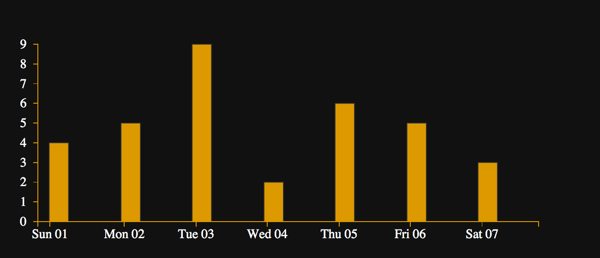

# Track-n-Treat

Halloween is great. Free candy. And I have six kids to go out and get it for me.
:)

I cull some of the finest chocolates from their bags after trick-or-treating and
enjoy them throughout the next week. We usually eat everything within a week...

This year I decided to track how much candy I ate, and which ones, in the week after
Halloween. It was only because we needed to do something like this for
[Praxis](http://praxis.scholarslab.org/memo/2015/10/30/track-the-treat/).
Otherwise I eat candy without a second thought.

## Getting started with d3

D3 is a Decent tool for visualizing Data, hence the name Data-Driven Documents.
It is basically a JavaScript framework for making charts, graphs, maps, or
anything you can images, based on data from a file, database, etc.

The best way to learn d3 is to practice it over and over. I suggest looking at
one or both of these d3 tutorials first.

- https://www.dashingd3js.com/table-of-contents
- http://alignedleft.com/tutorials/d3/about

After you've been through one, or both of them, try looking at my examples here: 

- https://github.com/mossiso/track-n-treat

# Making the chart

This post is an expanded version of the actual code files which contain lots of
comments.

## A note about data

How you structure the data is actually pretty important. It can make it super
easy or super hard to get at the information you want. The most simple method
usually is the best way to start. 

In my case, every time I ate a piece of candy, I took a note of what day it was,
what time, and which candy. Something like this:

`day: 2015-11-01, time: 11:15, candy: Snickers`

As it so happens, this is a great format. Each day on it's own line. The data
gets a little redundant, the day and time information are repeated many times,
but it makes it super easy to read and we can easily manipulate it later with
d3.

For d3 to use this, we have several options. CSV and JSON are the easiest to
work with, so I'll pick one of them.

A CSV option would look like this:

```
2015-11-01, 13:15, Snickers
2015-11-01, 15:24, KitKat
2015-11-02, 19:33, Twix
2015-11-02, 17:42, KitKat
2015-11-03, 21:51, Snickers
```

A JSON option is a bit more intense. Here I'm creating an array of objects.

```json
 [ 
   {"day": "2015-11-01", "time": "17:25", "candy": "Heath Bar"},
   {"day": "2015-11-01", "time": "17:25", "candy": "Kitkat Bar"},
   {"day": "2015-11-01", "time": "20:25", "candy": "Kitkat Bar"},
   {"day": "2015-11-02", "time": "17:38", "candy": "Whopper"}, 
   ... 
 ]
```

 This is an array (designated with square brackets `[]`) of objects (designated
 with curly braces `{}`). The object consists of names (day, time, candy) and
 their associated values. If we assign the above to the variable 'array', we can
 access the first element of the array with `array[0]`. That would return the
 first line above.

  > A good tutorial on JavaScript arrays is at Lynda.com (free subscription
  > through the [library](https://www.library.virginia.edu/lynda/)). Search for
  > 'Introducing the JavaScript Language with Joe Chellman'.

 To access any element within the object, we can use dot notation.
 
 `array[0].day` would return `2015-11-01`.  

`array[0].time` would return `17:25`. 
 
 `array[3].candy` would return `Whopper`.

*What would array[2].time return?*

*How would you get the value "Kitkat Bar" (there are two ways)?*


## Setting up the document

First off, we'll create a generic HTML page with the standard HTML

```html
<!DOCTYPE html>
<html lang="en">
    <head>
        <meta charset="utf-8">
        <title>D3 Test</title>
        <link href="styles.css" rel="stylesheet" type="text/css" />
        <script type="text/javascript" src="d3/d3.v3.js"></script>
    </head>
    <body>
    </body>
</html>     
```

Everything is pretty standard. The `<script>` tag is what pulls in the d3
library from the folder named 'd3'.

```<script type="text/javascript" src="d3/d3.v3.js"></script>```

Next we create a couple of divs, one for placing some text and links, and
another that we'll use to attach our graph to. This code goes in between the
`<body>` and `</body>` tags in the code above.

```html
      <div id="wrap">
        <h1>Track-n-Treat</h1>
        <p>How many candies did I eat each day the week after Halloween?</p>
        <div id="graph"></div>
      </div>
```

## Diving into D3

The rest of the code is written in JavaScript. The JavaScript can live anywhere
in the code: in between the `<header>` and `</header>` tags, or anywhere in
between the `<body>` and `</body>` tags.  I just put it after the above code
after the `<body>` tag.

To have JavaScript in the body of the HTML document, we'll surround it with
`<script>` tags like so:

```html
<script type="text/javascript">
 /* Add some JavaScript here.
    '/*' starts a multi-line comment, and the next line ends it.
*/

// This is a single line comment
</script>
```

Our first line of JavaScript, and d3, is one to pull in a file that has the data
in it. It is the first line within our `<script>` tags above.

```
d3.json("data/track-n-treat.json", function(data) {
  // More d3 code will go in here

}
```

This function surrounds all of the d3 code that makes the graph.  Supply the
path (relative to this html file) and a variable name for the data (within the
function's parenthesis) Here we pull in the data from a separate file. `d3` calls
the main d3 method, `.json` calls d3's json method that takes care of loading
all of the data from the json file. The json function needs a file path
(data/track-n-treat.json) that is relative to where this file is, and a function
that creates an internal variable/object to hold the data.

So now all of the data from the json file is available as a variable, in our
case it is named 'data'. (We could change that to anything we want.)

It's as if we had this in the code:

```javascript
data = [ 
   {"day": "2015-11-01", "time": "17:25", "candy": "Heath Bar"},
   {"day": "2015-11-01", "time": "17:25", "candy": "Kitkat Bar"},
   {"day": "2015-11-01", "time": "20:25", "candy": "Kitkat Bar"},
   {"day": "2015-11-02", "time": "17:38", "candy": "Whopper"}, 
   ... 
 ]
```

### Some Variables
Next, we'll set some variables to use later.

The 'margin' variable is really an object, so we can call the elements within
using dot notation like so: `margin.top` returns '40', or `margin.right` will
return '40'. 
```javascript
var margin = {top: 40, right: 40, bottom: 40, left:40},
    width = 700,
    height = 300,
    workingHeight = height - margin.top - margin.bottom;
```

### Axes

D3 can take care of a lot of the functionality of creating and placing the x and
y axes. D3 puts the axis in the right spot, puts the tick marks on, spaces them
appropriately, and labels the tick marks.

There are two parts to creating an axis. First, create a scale. Second, apply
the scale to the axis.

Let's start by making the x axis. 

#### The X-Axis (scale)
We want the x axis to show the days.

We'll use a time scale, since we're plotting days. We'll first set 'x' to be a
function that converts dates that we plug into it, into pixels on the screen.
Think of this as a range or scale converter.

The domain represents the minimum and maximum values that exist in the data. The
range is the minimum and maximum values as represented on the web page. This will
basically be a date to pixel converter.

  > For a great write up on how d3 scales work, look here:
  > - http://www.jeromecukier.net/blog/2011/08/11/d3-scales-and-color/

Our next line of code creates the x function and assigns the domain and range
for the scale. This code goes right after the variables we created above.

```javascript
var x = d3.time.scale()
          .domain([ new Date(data[0].day), d3.time.day.offset(new Date(data[data.length - 1].day), 1)])
          .rangeRound([0, width - margin.left - margin.right]);
```

Let's walk through this in a bit more detail.

D3's [time.scale](https://github.com/mbostock/d3/wiki/Time-Scales) function
takes a 'domain' and a 'range', which both take a minimum and maximum value. We
plug the minimum and maximum dates into the domain section and we set the pixel
limits in the range section.

The minimum date is the first day I ate candy, the maximum date is the last day
I ate candy. To calculate the first day, we can get the date from the data
array: 'data[0].day' corresponds with the first element in the 'data' array
(which is an object), and the value of that objects 'day' key.

Since the json file is assigned to the 'data' variable, we can get the first
'day' by accessing `data[0].day`. We put that in the default JavaScript `Date`
function to return the date as a String.

Getting the last day is similar, we can also get the last day from the data in
the json file. We just need to get the last object element in the array, and get
the value of the day element. But how do we specify which is the last element in
the array if we don't know how many elements there are? We could count, but what
if we change the data? 

We can do a little math to calculate the last element in the array. The
JavaScript builtin `.length` method gives us how many elements are in an array.
Since array elements begin counting at 0, we just get the length, number of
elements, minus 1 to give us the index of the last element. We can then we put
that into d3's `time.day.offset` function which adds or subracts a given amount of
days from the day that you input. In our case we'll offset by one day, so that
the axis goes from the first day until the day after the last day that I ate
candy.

The range is basically the width we specify above, but subtract some of the
padding. So the range would be from 0 to 620 (700 - 40 - 40).

A visualization of what the domain to range looks like

```bash
2015-11-1      2015-11-4         2015-11-8
   |---------------|-----------------|
  /                /                  \
 /                /                    \
|----------------|----------------------|
0                  88.5                620

```

#### The X-Axis (axis)

We create an x axis by calling the `d3.svg.axis` method, and assigning it to a
variable. Let's call it 'xAxis'.
```javascript
var xAxis = d3.svg.axis()
              .scale(x)
              .orient("bottom")
              .ticks(d3.time.days, 1)
              .tickFormat(d3.time.format('%a %d'));
```

Again, this can all be written out on one line, but we separate each chained
method onto its own line to make the code more legible.

We plug in the scale created above using the `.scale` method, and we assign an
orientation using the `.orient` method.

`.ticks` sets the ticks or marks on the x axis. `d3.time.days` sets a range of
days within the dates used in the scale (above). '1' means show each day in that
range (a '2' would show every other day in the range). 

`.tickFormat` sets the format for the tick to be a date using the
`d3.time.format` function in the form 'DDD ##'.

#### Y-Axis (scale)

The y-axis represents how many candies eaten each day. The height of this axis
is determined by the maximum number of candies eaten in a single day. A few
times I ate multiple candies at the same time. We'll need to get the number of
candies for each time period in a day and add them all up. This will determine
the max height of the y axis.

We'll use the d3 `nest` function which manipulates the data array.  The `key`
function pulls out all of the separate days as a key, the value is all of the
times that are associated with that day.

We can then use the `rollup` function to turn the values into something else. In
this case it returns the length of the values array, which is the number of
candies eaten that day.

```javascript
var timesPerDay = d3.nest()
                    .key(function(d) { return d.day; })
                    .rollup(function(t) { return t.length; })
                    .entries(data);
```

The `key` part of the `nest` function turns the data from this:

```javascript
[ 
{"day": "2015-11-01", "time": "17:25", "candy": "Heath Bar"},
{"day": "2015-11-01", "time": "17:25", "candy": "Kitkat Bar"},
{"day": "2015-11-01", "time": "20:25", "candy": "Kitkat Bar"},
{"day": "2015-11-02", "time": "17:38", "candy": "Whopper"}, 
{"day": "2015-11-02", "time": "18:38", "candy": "Whopper"}, 
... 
]
```

Into this:

```javascript
[
  {'key': '2015-11-01',
    'values': [
    {'day': '2015-11-01', 'time': '17:25', 'candy': 'Heath Bar'},
    {'day': '2015-11-01', 'time': '17:25', 'candy': 'Kitkat Bar'},
    {'day': '2015-11-01', 'time': '20:25', 'candy': 'Kitkat Bar'},
    ]
  },
  {'key': '2015-11-02',
    'values': [
    {'day': '2015-11-02', 'time': '17:38', 'candy': 'Whopper'}, 
    {"day": "2015-11-02", "time": "18:38", "candy": "Whopper"}, 
    ...
    ]
  },
  ...
]
```

And the `rollup` part of the `nest` function further converts the data into this:

```javascript
[
  {'key': '2015-11-01', 'values': 3 },
  {'key': '2015-11-02', 'values': 2 },
  ...
]
```

`.entries` is where we plug in which data is to be 'key'ed and 'rollup'ed. We
assign the result to the variable 'timesPerDay'.

Next we need to pull out the highest number from this array. 

```javascript
var maxEats = d3.max(timesPerDay, function(v) { return v.values; })
```

The `d3.max` function looks at an array and returns the highest value. It takes
an array and a function. The array is the 'timesPerDay' array we created above.
The function allows us to specify which part of the array to count. Here the `v`
stands for the array of day objects, and `v.values` is the 'values' element
within each day object, which holds the number of times a candy was eaten for
that day. So `d3.max` is now just looking at the different 'values' fields and
returns the highest number.  


Since we're just using numbers (not dates), we use a regular linear scale for
the y axis. We use the maximum number of candy in a day as the maximum for the domain.

```javascript
var y = d3.scale.linear()
          .domain([0, maxEats ])
          .range([workingHeight, 0]);
```

The range is the working height (the height minus the padding) to 0.

> What happens if the range is 0 to `workingHeight`

#### The Y-Axis (axis)

No we can create the y axis using the scale above.

```javascript
var yAxis = d3.svg.axis()
              .scale(y)
              .orient('left')
              .tickPadding(8);
```

Most of this is self-explanatory. The `.scale` calls the y scale we made above.
The `.orient` sets the axis on the left hand side. `.tickPadding` determines the
space between the tick marks. We set all of this to the variable name 'yAxis'.


We'll use the variables 'xAxis' and 'yAxis' later in the code.


### Put it all together

#### The main SVG element

This is where the magic happens. First, we create a variable/object for the svg
elements to live under, because we want to add to it later. `d3` calls the main
d3 method. `select` specifies which part of the DOM we want to target. We're
going to target an HTML div tag with the id 'graph'. 

```javascript
var svg = d3.select('#graph')
            .append('svg')
              .attr('class', 'graph')
              .attr('width', width)
              .attr('height', height)
            .append('g')
              .attr('transform', 'translate(' + margin.left +', ' + margin.right + ')');
```

This targets, or selects, the HTML tag with the id of 'graph'. We then append an
svg tag to the div tag, give it a class of 'graph', and set the width and
height.

Then we append an svg group element `g` where the chart will reside. We're going
to offset this group to create some padding where the axes will go. To better
understand the `transform` and `translate` functions, take a minute to read
through the section on 'SVG Transform as a Coordinate Space Transformation'.

- https://www.dashingd3js.com/svg-group-element-and-d3js

#### The graph section

We attach the graph using the [ selectAll ](
https://github.com/mbostock/d3/wiki/Selections#d3_selectAll ) method, and
attaching to our previously created `svg` variable/object. 

```javascript
svg.selectAll('.graph')
    .data(timesPerDay)
    .enter().append('rect')
      .attr('class', 'bar')
      .attr('x', function(d) {return x(new Date(d.key)) + 14; })
      .attr('y', function(d) { return workingHeight - (workingHeight - y(d.values)); })
      .attr('width', 24)
      .attr('height', function(d) { return workingHeight - y(d.values) });
```

The data we use in the `data` method is the `timesPerDay` array created above.
The `.enter` method represents the elements that will be appended to the svg
group. The elements that we will append are rectangles, `rect`. Basically, this
allows us to loop through the array and places the bar on the graph depending on
the x and y positions.

The x position for the bar uses the `x` function created above, the 'date' and
'14' for some padding. We give it the date, because the x scaler that we created
above will turn that into a pixel within the range that we can use.  

The y axis starts from the top of the screen, so we set the y location of the
bar to start at the highest value of the height (so it starts at the bottom of
the screen), then subract from that value to move the bar up the screen. We move
it up the height of the axis minus the number of candies that day.
The height is the workingHeight minus the number of candies.

### Attach the Axes

This just attaches the x axis to a svg group element

```javascript
svg.append('g')
    .attr('class', 'x axis')
    .attr('transform', 'translate(0, ' + workingHeight + ')')
    .call(xAxis);
```

Attach the y axis

```javascript
svg.append('g')
    .attr('class', 'y axis')
    .call(yAxis);
```
## Finish the JavaScript code and HTML page

We need to close the function we started above, and close the HTML script tag

```html
});
</script>

</body>
</html>
```

And there you have it. A bar graph showing how many candies I ate each day for
the week after Halloween. 

Next up, a graph to show how many times a day and which candies I ate for each
day.


# The complete code

Here's the code without the comments.

```html
<!DOCTYPE html>
<html lang="en">
    <head>
        <meta charset="utf-8">
        <title>D3 Test</title>
        <link href="styles.css" rel="stylesheet" type="text/css" />
        <script type="text/javascript" src="d3/d3.v3.js"></script>
    </head>
    <body>

      <div id="wrap">
        <h1>Track-n-Treat</h1>
        <p>How many candies did I eat each day the week after Halloween?</p>
        <div id="graph"></div>
      </div>

        <script type="text/javascript">
          d3.json("data/track-n-treat.json", function(data) {
            var margin = {top: 40, right: 40, bottom: 40, left:40},
                width = 700,
                height = 300,
                workingHeight = height - margin.top - margin.bottom;

            var x = d3.time.scale()
              .domain([ new Date(data[0].day), d3.time.day.offset(new Date(data[data.length - 1].day), 1)])
              .rangeRound([0, width - margin.left - margin.right]);

            var xAxis = d3.svg.axis()
                .scale(x)
                .orient("bottom")
                .ticks(d3.time.days, 1)
                .tickFormat(d3.time.format('%a %d'));

            var timesPerDay = d3.nest()
              .key(function(d) { return d.day; })
              .rollup(function(t) { return t.length; })
              .entries(data);

            var maxEats = d3.max(timesPerDay, function(v) { return v.values; })

            var y = d3.scale.linear()
              .domain([0, maxEats ])
              .range([workingHeight, 0]);

            var yAxis = d3.svg.axis()
                .scale(y)
                .orient('left')
                .tickPadding(8);

            var svg = d3.select('#graph').append('svg')
                .attr('class', 'graph')
                .attr('width', width)
                .attr('height', height)
              .append('g')
                .attr('transform', 'translate(' + margin.left +', ' + margin.right + ')');

            svg.selectAll('.graph')
                .data(timesPerDay)
              .enter().append('rect')
                .attr('class', 'bar')
                .attr('x', function(d) {return x(new Date(d.key)) + 14; })
                .attr('y', function(d) { return workingHeight - (workingHeight - y(d.values)); })
                .attr('width', 24)
                .attr('height', function(d) { console.log(y(d.values)); return workingHeight - y(d.values) });

            svg.append('g')
              .attr('class', 'x axis')
              .attr('transform', 'translate(0, ' + workingHeight + ')')
              .call(xAxis);

            svg.append('g')
              .attr('class', 'y axis')
              .call(yAxis);

          });
        </script>

    </body>
</html>     

```
