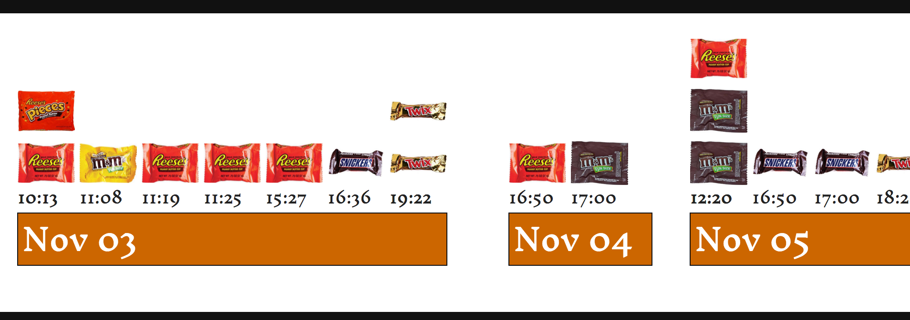

# When did I eat all those candies?

This second visualization will answer the above question, and also which candies I
ate.

So the visualization will show each day, and within each day it will show the
time period that I had candy, and an image of the candy will designate what kind of
candy, and how many at that time period.

# D3 code

This uses the exact same data file as the previous chart,
`data/track-n-treat.json`, but we build it in an entirely different way.  We'll
also spice it up with some images.

## Begin the HTML document

We start this file much like the previous.

```html
<!DOCTYPE html>
<html lang='en'>
    <head>
        <meta charset='utf-8'>
        <title>Track-n-Treat</title>
        <link href='styles.css' rel='stylesheet' type='text/css' />
        <link href='https://fonts.googleapis.com/css?family=Inknut+Antiqua' rel='stylesheet' type='text/css'>
        <script type='text/javascript' src='d3/d3.v3.js'></script>
    </head>
    <body>
      <h1>Track-n-Treat 2015</h1>
      <p>Tracking how many candies I ate in the week after Halloween.</p>
      
      <div id='wrapper'>
        <div id='chart'></div>
      </div>
```

A new line here than the previous document is the 'link' tag pulling in a Google
font. We'll add that as the default font, to give the text a more Halloweeny
look.

The two HTML div tags are what the svg will be attached to. Having them allows
the svg to scroll because the graph will be longer horizontally than the screen.


### Begin the JavaScript and D3

We start the JavaScript and D3 code the same way as before.

```html
<script type='text/javascript'>
  d3.json('data/track-n-treat.json', function(data) {
    var w = 2500;
    var h = 300;

    var barW = 60;
    var barH = 55;
```

We start with the d3 method to pull in the json file. This includes a function
that surrounds the rest of the d3 code.

We also set an arbitrary width and height. We'll use these variables later for
the dimensions of the main svg element. We also set the width and height that
will be used as a representation of a candy bar.

### Massaging the data

We need to nest the data, and group the candy by day and time. We'll use the d3
'nest' method and set the new array to the variable 'nested' 

> For more help on understanding nesting see: http://bl.ocks.org/shancarter/raw/4748131/ 

Nesting our data will reformat the array from looking like this:

```json
 [ 
   {'day': '2015-11-01', 'time': '17:25', 'candy': 'Heath Bar'},
   {'day': '2015-11-01', 'time': '17:25', 'candy': 'Kitkat Bar'},
   {'day': '2015-11-01', 'time': '20:25', 'candy': 'Kitkat Bar'},
   {'day': '2015-11-02', 'time': '17:38', 'candy': 'Whopper'}, 
   ... 
 ]
```

 To look like this:

 ```json
 [
   { 'key': '2015-11-01',
     'values': [
                 {'key': '17:25',
                  'values': [
                              {'candy': 'Heath Bar', 'day': '2015-11-01', 'time': '17:25'},
                              {'candy': 'Kitkat Bar', 'day': '2015-11-01', 'time': '17:25'}
                            ]
                 },
                 {'key': '20:25',
                  'values': [
                              {'candy': 'Kitkat Bar', 'day': '2015-11-01', 'time': '20:25'}
                            ]
                 }
               ]
   },
   {'key': '2015-11-02',
    'values': [
                {'key': '17:38',
                 'values': [
                            {'candy': 'Whopper', 'day': '2015-11-02', 'time': '17:38'}
                           ]
                }
              ]
   }
   ...
 ]
 ```

 Here is the code to do that:

```javascript
var nested = d3.nest()
    .key(function(d) { return d.day; })
    .key(function(t) { return t.time; })
    .entries(data);
```

 Basically, this makes a group of all the lines in the original array that have
 the same day. Then within that group, it makes a group for each time. It's like
 an onion, with different layers of data.

### Making the graph

```javascript
var svg = d3.select('#chart').append('svg')
    .attr('class', 'graph')
    .attr('width', w)
    .attr('height', h)
  .append('g')
    .attr('transform', 'translate(20,20)');
```

This creates the actual SVG canvas/element where the graph will be displayed.
Select the div element with an id of 'graph', append an svg tag/element,
give it a CSS class of 'graph', and set the width to the 'w' variable and the
height to the 'h' variable as we assigned above. 

Finally, append a group tag/element. This group is offset 40 pixels down and 40
pixels over from the original origin point. To better understand transform and
translate read the section on SVG Transform as a Coordinate Space Transformation
at https://www.dashingd3js.com/svg-group-element-and-d3js 

The 20 pixels down and over are for padding, especially useful if there are axis
lines and markers. We don't have axes in this visualization, but the padding is
still useful.

### Doing it old school

This is where all of the magic really happens. The data is used to place the
points on the graph, create the bars, etc. Instead of using built in d3
functions for looping through the data, we'll use default JavaScript control
structures, the `forEach` loop. 

First we'll assign a default x position. This will determine the first position
on the x-axis, which should start at 0.  

```javascript
var xPos = 0;
```
Let's also declare some variables that we'll use later.

```javascript
var prevDayTime, thisDayTime, thisDay, prevDay;
```

#### Loop the loop
Next we'll do a series of loops through the data, each loop associated with the
groups created in the nested array that was created above. 

The first level is the day object. The JavaScript 'forEach' is a relatively new
built in function specifically for iterating over arrays.

The first time through 'forEach' returns an object where the 'key' is the date
and the 'values' is an array of objects.  

In the second 'forEach', we go through the 'values' of the first level.  This
returns an object, where the 'key' is the time and the 'values' is an array of
objects that contain the date, time and candy. 

Next, the third 'forEach' of the levelTwo 'values' array gives us each instance
when the candy was eaten.  

Here is the basic structure of the 'forEach' loops. We'll add more code in
the next steps.

```javascript
nested.forEach(function(dayObject) {
    dayObject.values.forEach(function(timeObject, dayIndex) {
        timeObject.values.forEach(function(candyObject, timeIndex) {
        });
    });
});
```

In the function section of the last two 'forEach' methods, we create an object
and an index. The 'index' for each of these is the index number of the array
element. For the last 'forEach', the 'candyObject' contains the day, time and
candy.

#### Making the graph

The first thing we'll need to do is create an svg group element to contain each
day.

```javascript
nested.forEach(function(dayObject) {
    dayGroup = svg.append('g');

  dayObject.values.forEach(function(timeObject, dayIndex) {
    timeObject.values.forEach(function(candyObject, timeIndex) {
```

Then we need to pull some information from that specific instance of eating a
candy. We need the day and the day and time together. We don't need to declare
these variables with `var` because we did that already above.

```javascript
      thisDayTime = candyObject.day +' '+ candyObject.time;
      thisDay = candyObject.day
```

As we loop through each of
the instances, we'll need to check several things.
 - Is this the last instance at this time?
 - Is this the last instance for this day?
 - Is this the same time and day, but a separate instance (sometimes I had two
   or three candy bars within the same minute)?

If the current day and time is the same as the previous day and time, then the x
position should be the same. Later in the code we add 25 to the current x
position, so that the next time through the loop, the x position of the
box is further away from previous box. If it's the same time and day, then we
subtract that 25 we add on later to put it back to the same position as the
previous time.

```javascript
      if (thisDayTime === prevDayTime) {
        xPos = xPos - barW - 5;
      }
```

#### The candy man cometh

Next we start creating the candy elements of the graph. We could use boring bars
and boxes, or we could use images of actual fun size candy bars and those yummy
fun size packets of M&M's and Reese's Pieces.

We can do this by appending an image to the `dayGroup` svg group element we
created before.

```javascript
      dayGroup.append('image')
          .attr('xlink:href', 'images/' + candyObject.candy + '.jpg')
          .attr('class', 'bar')
          .attr('x', xPos)
          .attr('y', h - (barH * timeIndex + 190))
          .attr('width', barW)
          .attr('height', barH);
```

The first `.attr` tells d3 where to find the image to use; the `xlink:href`
states there is a path to follow. The next part is the path to the image. We use
the name of the candy supplied from the `candyObject` object. All of the image
files have the same name as those used in the data (the json file), so each
different candy can use the specific image for that candy.

Assign the svg element a class of 'bar' so we can style it if we need to.

The x position is dealt with elsewhere. The first time through the loop, for the
very first instance, it is zero. Subsequent instances have an increased x
position, or the same x position if the time is the same as the previous time.

The next bit of trickery is where to place the image vertically.  Remember the y
axis starts from the top of the screen, so we set the y location of the candy
bar box to start at the highest value of the height (so it starts
at the bottom of the screen), then subtract from that value to move the box up
the screen.  Some time periods have multiple candies (I ate two or three within
one minute), so their x position is the same, but the y position needs to be
higher. 

To do this we'll use the array's index number to provide a variable in a made up
formula for increasing the height. We want the stacked candy boxes to start a
specific point, lets say 190 pixels above the bottom of the svg 'canvas' that we
create. The first candy for a time will then start at '400 - (35 * 1 + 190)'.
That means starting at the bottom of the screen '400', we'll subtract 190, so
half way up the canvas, plus move it up 35 for some padding. Halfway up the
canvas gives us room for the times and date bars. Subsequent candy boxes will be
bumped up '35 * 2' or '35 * 3' providing a stacked look.

> Play with the numbers to see how the boxes move up or down.

#### Time for some labels

We need to add the time that each candy was eaten. We do this in a similar
manner as adding the candy images, but appending text rather than images.

```javascript
      dayGroup.append('text')
         .attr('class', 'time')
         .text(candyObject.time)
         .attr('x', xPos)
         .attr('y', h - (barW * 2))
         .attr('width', barW)
         .attr('height', barH);

```
This is very similar to the above. We append a text element to the `dayGroup`
element we created before. The `.text` line is where we add the text. The text
is just the time, which we can get from the `candyObject`. 

`candyObject = {'day': '2015-11-xx', 'time': 'xx:xx', 'candy': 'Xxxx'}`

Each `candyObject` object has this info associated with it. The 'x' is replaced
each time it goes through the loop.

The x position, `xPos`, is set and the same as the candy wrapper image.

The y position will be the same for each time period. We'll set it initially at
the height of the 'canvas', so it starts at the very bottom. Then we'll subtract
some amounts to get it to a good spot. We can use the width variable for a set
number, and then let's multiply that by 2 for fun. We could have just used a
static number, like '100', but this way the height adjusts to any changes in the
other aspects of the graph. If we change how big the candy bar wrappers are,
then the time labels automatically adjust.

> Play around with those numbers, replace the 'h' and 'barW' with actual numbers.


#### A box for each day

We're placing something on the screen for the candy wrapper image and the time
each time we loop through. At the times were there are multiple candies at the
same time, there are actually multiple times overlayed. They are in the exact
same place, so you only see the one. This won't work for the boxes that
represent the days. We only want one box. 

One way to solve this is to only draw the day box the very first time an
instance of that day comes up in our loop. This is where our `thisDay` and
`prevDay` variables come into play. We can check the current date with the
previous date. If the current date is the same as the `prevDate` variable, then
it is the same day, so don't draw a box. The only time `thisDay` will not equal
`prevDay` is when `thisDay`'s instance is the next day.

Hmm, that's really hard to explain, and this probably confuses more than
clarifies.

```javascript
      // add the day boxes
      if (thisDay !== prevDay) {
        dayGroup.append('rect')
           .attr('class', 'day')
           .attr('x', xPos)
           .attr('y', h - 110)
           .attr('width', (dayObject.values.length * barW + barW/2))
           .attr('height', barH);

```

Here we append a rectangle to the `dayGroup` object, give it a CSS class, set
the x position to `xPos`, and the y position to a set number. This time we took
the lazy way and just subtracted a static number from the height.

The width is the tricky part here. We want the width of the bar to be the length
of all of the time elements for that day. We can get the number of times for a
day from the `dayObject` object. The key is the date, and the value is an array
of times. So we can get the number of times in a day with dot notation and the
array `length` method, `dayObject.values.length`. That gives us a single digit,
so we need to multiply that by the width of the candy bar image,
`dayObject.values.length * barW`. Then add some more for padding. We can
dynamically get a number by using the candy bar image width divided by 2,
`barW/2`. That gives us a number that approximates the width taken up by all of
the time elements for a day.

Making the box is only half the job. We should add some text so we know which
day it is that we are adding. Let's use the month and day in the format 'MMM
DD', so the month name using three letters, and the two digit day of the month.

```javascript
        dateForm = d3.time.format('%b %d')
        dayGroup.append('text')
           .attr('class', 'date')
           .text(dateForm(new Date(thisDayTime)) )
           .attr('x', xPos + 5)
           .attr('y', h - barW - 10);
      }

``` 

To get the date we'll use d3's default [time formating
method](https://github.com/mbostock/d3/wiki/Time-Formatting), `d3.time.format`.

`dateForm = d3.time.format('%b %d')` creates a function that will take a date
object and return it in the format 'Month ##' 

`.text( dateForm(new Date(thisDayTime)) )` 

From the inside out: `thisDayTime` is the year-month-day and time variable we
create above. 

We use Javascript's `new Date()` function to return a string from the time.

Then we use the `dateForm` function we created to format the date the way we
want.


#### Make a little buffer

If it's the last time of the day, and the last candy for that time, add in a
space bumper. Without it the days are squished together. This adds a visually
appealing space between the days.

```javascript
      if ( ( dayIndex == (dayObject.values.length - 1) ) && ( timeIndex == (timeObject.values.length -1) ))
      {
        xPos = xPos + barW;
      }
``` 
We use an if statement to check if it's the last day and the last time for that
day. If so we need to increase the x position by the width of the candy bar
image. Otherwise it will be at the same position as the last time. We don't need
to add an actual svg element, just increase the x position for the next time
through the loop.

#### Increment the incrementables

Finally, we need to increment the x position and set the `prevDayTime` variable
to `thisDayTime` and the `prevDay` variable to `thisDay`.

```javascript
      xPos = xPos + barW + 5;
      prevDayTime = thisDayTime;
      prevDay = thisDay;

```

### Finish it

Close off the `forEach` loops
```html
                });
              });
            });
```

Close off the encompassing d3 function, and close off the HTML tags to
finish of the file.

```html
          });
        </script>
    </body>
</html>     
```

## Complete code without comments

```html
<!DOCTYPE html>
<html lang="en">
    <head>
        <meta charset="utf-8">
        <title>Track-n-Treat</title>
        <link href="styles.css" rel="stylesheet" type="text/css" />
        <link href='https://fonts.googleapis.com/css?family=Inknut+Antiqua' rel='stylesheet' type='text/css'>
        <script type="text/javascript" src="d3/d3.v3.js"></script>
    </head>
    <body>
      <h1>Track-n-Treat 2015</h1>
      <p>Tracking how many candies I ate in the week after Halloween.</p>
      
      <div id="wrapper">
        <div id="chart"></div>
      </div>

        <script type="text/javascript">
          d3.json("data/track-n-treat.json", function(data) {
            var w = 2500;
            var h = 300;

            var barW = 60;
            var barH = 55;

            var nested = d3.nest()
                .key(function(d) { return d.day; })
                .key(function(t) { return t.time; })
                .entries(data);

            var svg = d3.select('#chart').append('svg')
                .attr('class', 'graph')
                .attr('width', w)
                .attr('height', h)
              .append('g')
                .attr('transform', 'translate(20,20)');

            var xPos = 0;
            var prevDayTime, thisDayTime, thisDay, prevDay;

            nested.forEach(function(dayObject) {
                dayGroup = svg.append('g');
              dayObject.values.forEach(function(timeObject, dayIndex) {
                timeObject.values.forEach(function(candyObject, timeIndex) {

                  thisDayTime = candyObject.day +' '+ candyObject.time;
                  thisDay = candyObject.day

                  if (thisDayTime === prevDayTime) {
                    xPos = xPos - barW - 5;
                  }

                  dayGroup.append('image')
                      .attr('xlink:href', 'images/' + candyObject.candy + '.jpg')
                      .attr('class', 'bar')
                      .attr('x', xPos)
                      .attr('y', h - (barH * timeIndex + 190))
                      .attr('width', barW)
                      .attr('height', barH);

                  dayGroup.append('text')
                     .attr('class', 'time')
                     .text(candyObject.time)
                       .attr('x', xPos)
                       .attr('y', h - (barW * 2))
                       .attr('width', barW)
                       .attr('height', barH);

                  if (thisDay !== prevDay) {
                    dayGroup.append('rect')
                       .attr('class', 'day')
                       .attr('x', xPos)
                       .attr('y', h - 110)
                       .attr('width', (dayObject.values.length * barW + barW/2))
                       .attr('height', barH);

                    dateForm = d3.time.format("%b %d")
                    dayGroup.append('text')
                       .attr('class', 'date')
                       .text(dateForm(new Date(thisDayTime)) )
                       .attr('x', xPos + 5)
                       .attr('y', h - barW - 10);
                  }

                  if ( ( dayIndex == (dayObject.values.length - 1) ) && ( timeIndex == (timeObject.values.length -1) ))
                  {
                    xPos = xPos + barW;
                    dayGroup.append('rect')
                      .attr('class', 'bumper')
                      .attr('x', xPos)
                      .attr('y', h - 110)
                      .attr('width', barW)
                      .attr('height', barH);
                  }

                  xPos = xPos + barW + 5;
                  prevDayTime = thisDayTime;
                  prevDay = thisDay;

                });
              });
            });

          });
        </script>
    </body>
</html>     
```
